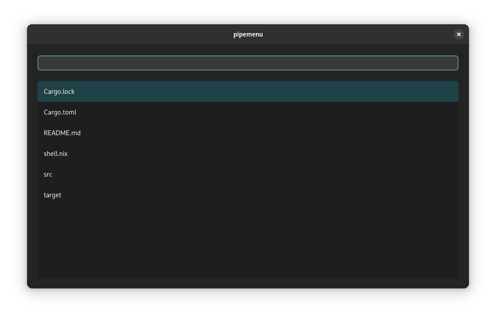

# Pipemenu

Gnome (`GTK4` + `libadwaita`) compatible `dmenu` alternative.

It is **not** application launcher. It accepts input from stdin, allows user to select desired entry, and returns that entry on stdout.

## Usage

```sh
ls | pipemenu | xargs xdg-open
```



## Roadmap

See [Issues](https://github.com/soanvig/pipemenu/labels/enhancement)

## Development

`pipemenu` uses `gtk4-rs` therefore [GTK building instructions](https://gtk-rs.org/gtk4-rs/stable/latest/book/installation_linux.html) and [Adwaita building instructions](https://gtk-rs.org/gtk4-rs/stable/latest/book/libadwaita.html) apply.

Currently `gtk4` and `libadwaita` development dependencies are required with versions matching what's defined in `Cargo.toml`.
